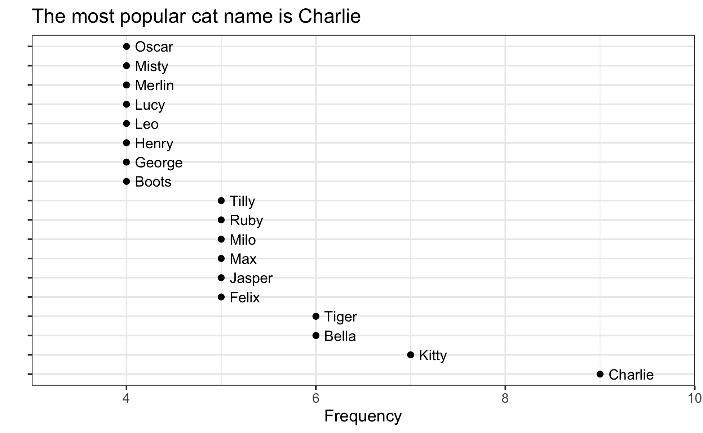
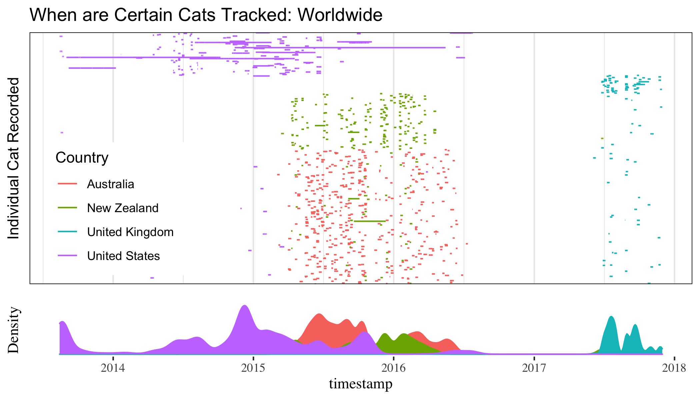
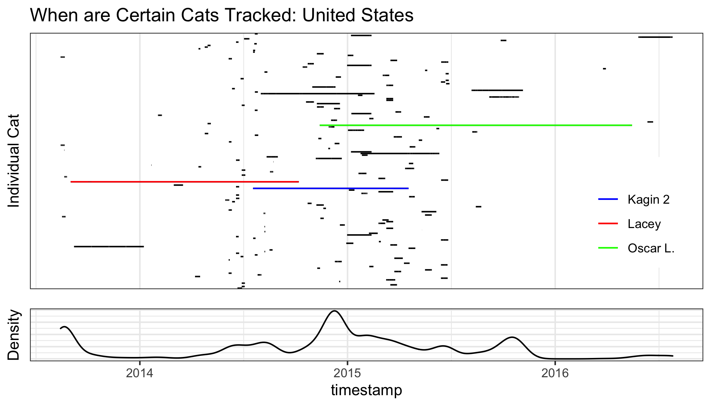
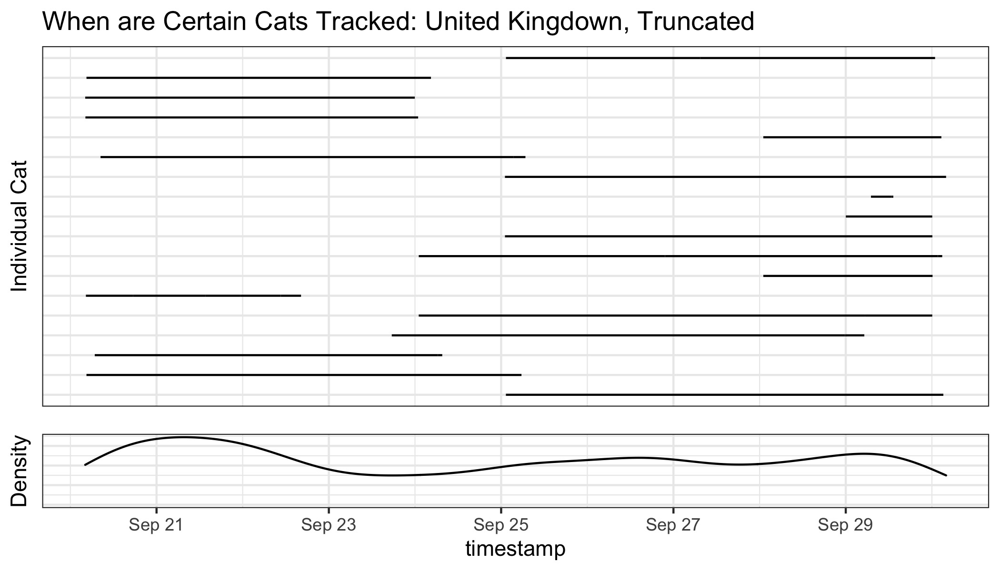
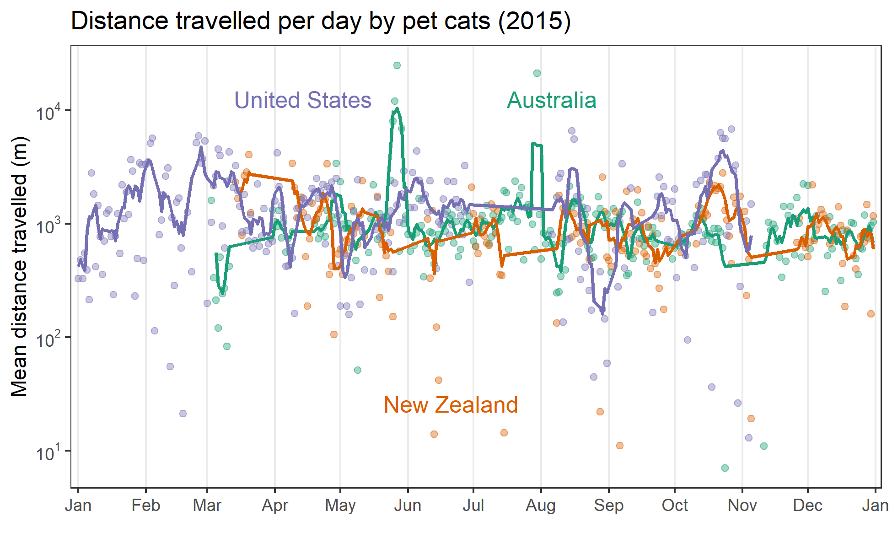
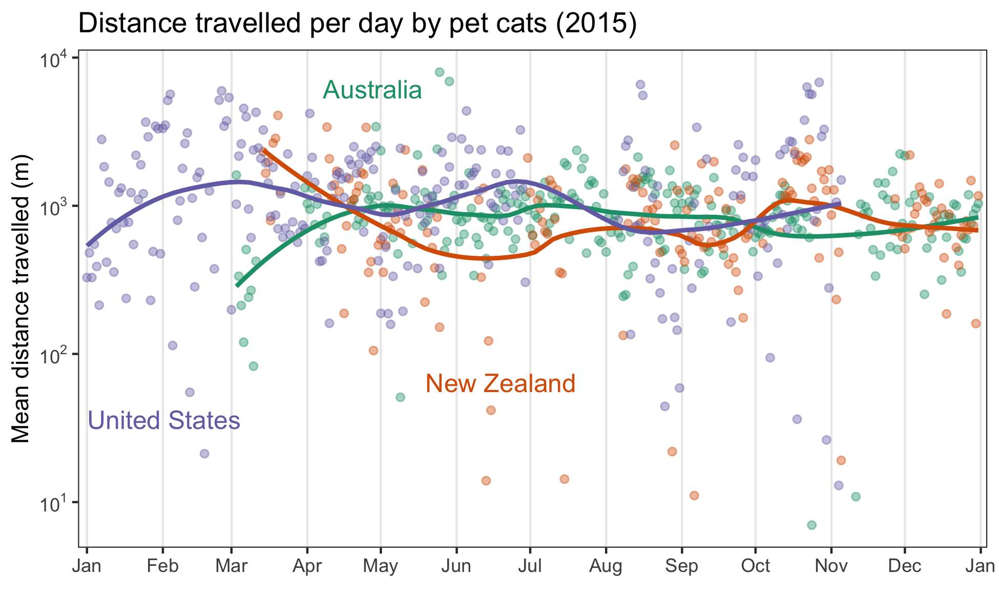

## Data 

- movebank.org
- gps coordinates, timestamps, age, sex, reproductive status

Country          |   Years  | Number of Cats
-----------------| ---------| --------------
Australia        | 2015-2016|  442
New Zealand      | 2015-2017|  233
United Kingdom   | 2017     |  101
United States    | 2013-2016|  154


## Data Exploration

- Cats are tracked over different time intervals. 

- E.g. Oscar L. from America is tracked over more than a year.

- Jim from the UK is tracked over less than two days. 

- How we structure animations depends on the underlying timestamp intervals. 

## Data Structure

- Store name, speed, latitude, longitude, sex, repoductive condition, age

- Names!

---

```{r, out.width = "700px", echo=FALSE, fig.align="center"}

```


## Good but unpopular names

- Unfriendly  from Australia

- Captain America from the UK

-


## Data Exploration --- Global

```{r, out.width = "700px", echo=FALSE, fig.align="center"}

```

## Data Exploration --- National

```{r, out.width = "700px", echo=FALSE, fig.align="center"}

```

## Data Exploration --- National, Truncated

```{r, out.width = "700px", echo=FALSE, fig.align="center"}

```


## Distance Travelled

- Are there seasonal patterns over time?

- Are there differences between countries?


---

```{r, out.width = "780px",fig.align="center", echo=FALSE}

```


---

```{r, out.width = "780px",fig.align="center", echo=FALSE}

```

## Spatial Movements

- Are there spatial or temporal cycles or patterns to their movement?

- How do neighbouring cats interact spatially?


## Spatial Movements

```{r, out.width = "550px", echo=FALSE, fig.align="center"}
knitr::include_graphics("Molly_Max2.gif")
```


